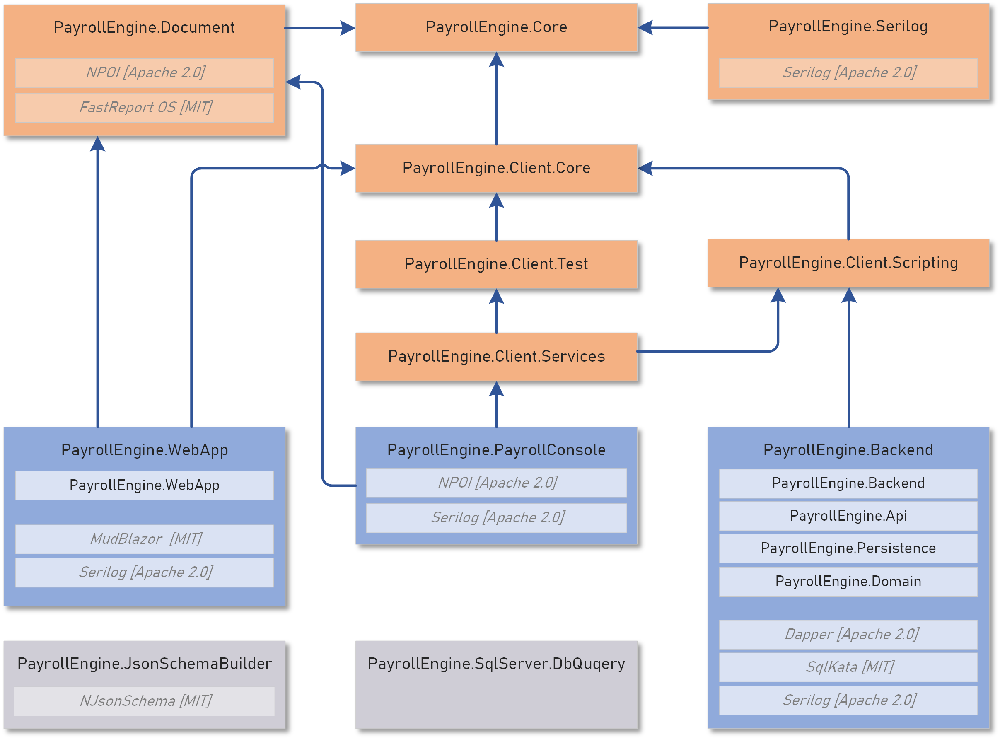

<h1>Payroll Engine GitHub Repsitories</h1>

# System Repositories

Die Payroll Engine besteht aus folgenden System Repositories:

  

| Repository                          | Content                     | URL                                                                   | Third Party |
|--|--|--|--|
| *PayrollEngine*                     | Main repository             | https://github.com/Payroll-Engine/PayrollEngine.git                   |             |
| *PayrollEngine.Core*                | Core payroll objects        | https://github.com/Payroll-Engine/PayrollEngine.Core.git              |             |
| *PayrollEngine.Serilog*             | System logger               | https://github.com/Payroll-Engine/PayrollEngine.Serilog.git           | - [Serilog](https://serilog.net/) [Apache 2.0] |
| *PayrollEngine.Document*            | Document/Report generation  | https://github.com/Payroll-Engine/PayrollEngine.Document.git          | - [NPOI](https://github.com/dotnetcore/NPOI) [Apache 2.0] - [FastReport](https://github.com/FastReports/FastReport) [MIT] |
| *PayrollEngine.Client.Core*         | Client core payroll objects | https://github.com/Payroll-Engine/PayrollEngine.Client.Core.git       |             |
| *PayrollEngine.Test*                | Client test library         | https://github.com/Payroll-Engine/PayrollEngine.Client.Test.git       |             |
| *PayrollEngine.Client.Scripting*    | Client scripting            | https://github.com/Payroll-Engine/PayrollEngine.Client.Scripting.git  |             |
| *PayrollEngine.Client.Services*     | Main client services        | https://github.com/Payroll-Engine/PayrollEngine.Client.Services.git   |             |
| *PayrollEngine.Backend*             | Backend server              | https://github.com/Payroll-Engine/PayrollEngine.Backend.git           | - [Dapper](https://github.com/DapperLib/Dapper) [Apache 2.0] - [SqlKata](https://github.com/sqlkata/querybuilder) [MIT] - [Serilog](https://serilog.net/) [Apache 2.0] |
| *PayrollEngine.PayrollConsole*      | Console application         | https://github.com/Payroll-Engine/PayrollEngine.PayrollConsole.git    |             |
| *PayrollEngine.WebApp*              | Web application             | https://github.com/Payroll-Engine/PayrollEngine.WebApp.git            |             |
 

## Tools
| *PayrollEngine.JsonSchemBuilder*    | JSON schema generation      | https://github.com/Payroll-Engine/PayrollEngine.JsonSchemaBuilder.git | [NJSonSchema](https://github.com/RicoSuter/NJsonSchema) [MIT] |
| *PayrollEngine.WebApp*              | Excecute SQL Server queries | https://github.com/Payroll-Engine/PayrollEngine.SqlServer.DbQuery.git |             |

# Regulation Repositories

| *PayrollEngine.CH.Swissdec*         | Swissdec ELM5 payroll       | https://github.com/Payroll-Engine/Regulation.CH.Swissdec.git          |             |
