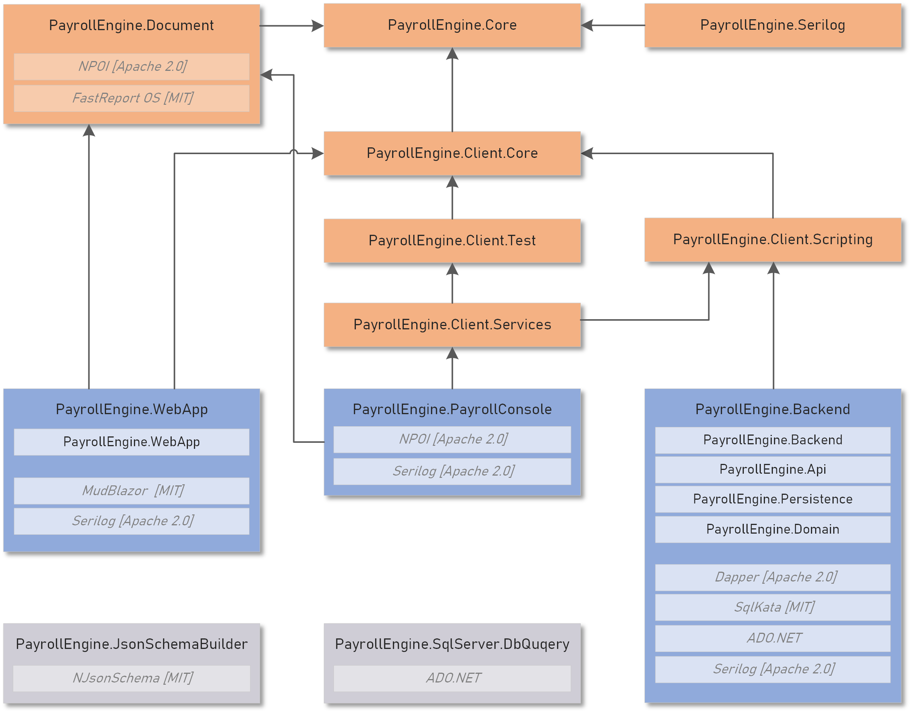

Payroll Engine 
<pspan style="font-size: 12px">Open Global Payroll Engine  

# 1 Introduction
Die PE dient als Grundlage zur Entwicklung von Landes-, Branchen- und Unternehmensspezifischen Lohnlösungen. Die Lohnlösungen werden in Form von Regulierungen mit Low-Code und No-Code entwickelt und eingebunden.

> PE ist neutraler Lohnrechner, ohne Kenntnisse von Geschäfts und Mitarbeiterdaten. Zur Berechnung der Löhne sind Regulierungen erforderlich.

Obwohl die Lohnberechnung  komplex ist und in jedem Land variiert, orientiert sich die PE an die grundsätzlichen Verarbeitungsschritte: Eingabe (Case Management), Verarbeitung (Payrun) und Ausgabe (Report). Im Fokus der Systemarchitektur steht die Automatisierung und Vereinfachung des Lohnprozesses sowie die Nutzung der gesetzlich erforderlichen Daten.

Als REST API lässt sich die PE in jegliche Weblösung einbinden. Alternativ bieten eine Konsolen- und Webapplikation den vollständigen API Zugriff.

Neben der Quelloffenheit der PE (MIT), sind auch alle genutzten Fremdkomponenten Open-Source. Die mit PE eingeführten Innovationen setzen ein technisches Verständnis voraus. 

> Ziel dieser Code-Offenlegung ist es, die kostenlose Möglichkeit zu bieten, eigene Regulierungen zu entwickeln und verwenden. 

 

# 2 Features
## Multi Country
## Regulations
- Input
- Process
- Output
## Open Source
*Donations*

 

# 3 Usage
## Build Payroll Solutions
- Setup Organisation
## REST API Integration
- [Endpoints](Documents/PayrollRestServicesEndpoints.md)
- Swagger.json
- Webhooks
## .NET Integration
- NuGets

 

# 4 Ressources
## Documents
- Community Guidelines and [Software Enginnering](Documents/SoftwareEngineering.md)
- White Paper
- Repository Map  
- [API Endpoints](Documents/PayrollRestServicesEndpoints.md)
## Tutorials
Client Development Tutorials: [README.md] in Repository *PayrollEngine.Client.Tutorials*
## Examples
Local repository folder [Examples]
## Tests
Local repository folder [Tests]
## Payroll Console
Import/Export, Tests, Reports
## Web Application
Web Client with access to all engine features

 

# License
MIT
